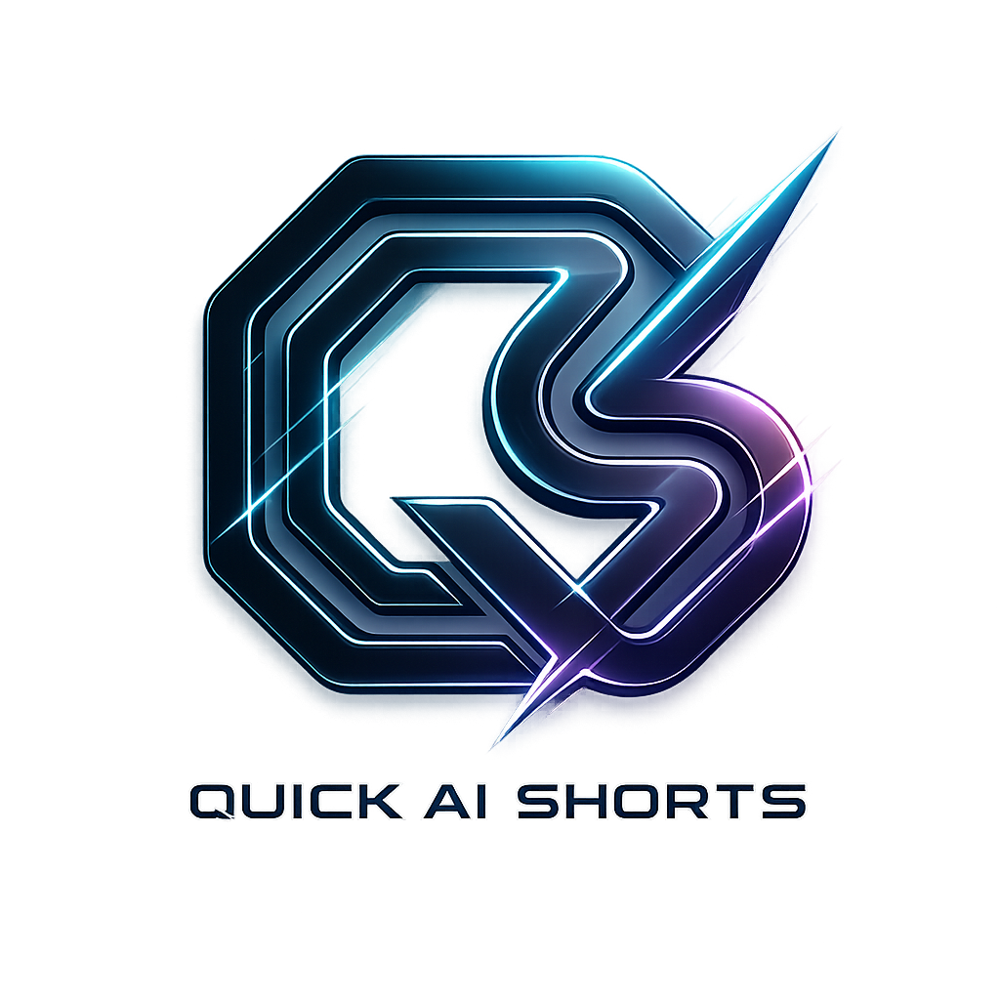

<div align="center">

<br />

<br /> <br />
### Conversational AI video editing — from long-form to finished short.

<br />

[](https://www.quickaishort.online)
&nbsp;
[](https://github.com/HassaanFisky/quickaishort/actions/workflows/linter.yml)
&nbsp;
[](https://ai.google.dev/)
&nbsp;
[](https://google.github.io/adk-docs/)
&nbsp;
[](LICENSE)

<br />

**[Live product](https://www.quickaishort.online)** · **[Studio docs](docs/studio/README.md)** · **[Architecture](ARCHITECTURE.md)** · **[Vision](VISION.md)** · **[Contributing](CONTRIBUTING.md)**

<br />

</div>

---

## What it is

**QuickAI Short** turns long-form video into short-form content using conversational AI.

You paste a YouTube URL or upload a local file. You chat with the AI editor. You get intelligent edit suggestions, refine them in natural language, preview the result, and export.

The AI performs the editing. You direct the creativity. The conversation is the workflow.

This is not “just another AI clipper.” It is a production editor where language drives real edit operations — trim, captions, pacing, reframing, audio, and more — applied to a live timeline and exported through a server render pipeline.

---

## Who it helps

Creators, podcasters, educators, and teams who need to move from long source media to publish-ready shorts without spending hours in a traditional NLE.

---

## Product identity

| Name | Role |
|------|------|
| **QuickAI Short** | Production product today — conversational editor, ingest, preview, export |
| **QuickAI Studio** | Evolution of QuickAI Short into an AI-native video editing operating system |

They are one product lineage — not separate products. Studio Kernel work (Capability Registry, Project Document, MediaGraph, Orchestrator, chat-primary shell) already ships under feature flags; deeper ADK-powered orchestration remains the roadmap.

Canonical product and architecture truth: [`docs/studio/`](docs/studio/README.md) · [`PHASE2_ARCHITECTURAL_TRUTH_REVIEW.md`](docs/studio/PHASE2_ARCHITECTURAL_TRUTH_REVIEW.md) · [`CANONICAL_PROJECT_MEMORY.md`](docs/studio/CANONICAL_PROJECT_MEMORY.md)

---

## How it works

```text
YouTube URL or local upload
        ↓
Ingest + transcription (browser Whisper) + optional analysis
        ↓
Conversational AI editor (Gemini) → structured edit actions
        ↓
Client NLE preview (Zustand timeline) + MediaGraph suggestions
        ↓
Export → Redis/RQ worker → ffmpeg → GCS signed download
```

**Optional capability — Pre-Flight:** Google ADK multi-agent audience simulation (six personas, trend/analytics grounding, consensus score). Available as a validation skill — not the product’s sole identity.

**ADK workspace UI (`/adk`):** Coming Soon — intentionally blurred and not available until release. Do not treat it as a live creator wizard.

---

## Current capabilities (production)

- Paste YouTube URL or upload local video
- In-browser Whisper transcription (Web Worker)
- Conversational AI editor with natural-language commands
- MediaGraph-grounded suggestion chips (not hardcoded heuristic lists)
- Live preview with Web Audio chain (noise reduction + boost)
- Multi-track timeline visualization
- Server-side export via RQ + ffmpeg-python → GCS
- Cancel, runId isolation, render DLQ, and status observability
- Studio Kernel APIs (project document, orchestrator, media graphs) behind flags
- NextAuth JWT auth on protected backend routes

---

## Future direction (QuickAI Studio)

QuickAI Studio evolves QuickAI Short into an AI-native editing OS:

- The AI understands media
- The AI plans edits
- The AI orchestrates tools (Capability Registry ABI — EP-001, frozen)
- The AI performs editing through real tools
- The user guides intent
- The timeline becomes visualization — not the primary control surface

Deeper Google ADK orchestration, native Gemini tool-loop depth, and the ADK workspace UI are roadmap — not claimed as fully shipped product surfaces.

---

## Architecture (summary)

| Layer | Choice |
|-------|--------|
| Frontend | Next.js 14.2.35 · App Router · TypeScript · Zustand · Tailwind v4 |
| Backend | Python 3.12 · FastAPI · Pydantic v2 |
| AI | Gemini 2.5 Flash · Google ADK for Pre-Flight agents · Studio Kernel orchestration |
| Queue | Redis · RQ (`render_worker.py`) |
| Media storage | **GCS** primary (`quickaishort-agent-494304-media`); MongoDB GridFS = legacy `/api/v1/video/*` only |
| Data | MongoDB (history/credits paths) · Firestore (agent sessions / some stats) |
| Auth | NextAuth HS256 JWT ↔ FastAPI `auth.py` |
| Deploy | Vercel (frontend) · Cloud Run (`quickai-api` + `quickai-worker`) |

Frozen contracts: EP-001 Capability Registry ABI · ADR-002 GCS · ADR-007 Registry · ADR-008 Project Document · ADR-009 MediaGraph suggestions · ADR-013 ADK Coming Soon.

---

## Cost-efficient engineering

Operational cost is a first-class acceptance criterion. Prefer event-driven / scale-to-zero where safe; deduplicate AI calls, uploads, and renders; avoid polling when streams/webhooks work; bound every expensive operation with timeout, attribution, and cancellation.

Policy: [`.cursor/rules/cost-efficient-architecture.mdc`](.cursor/rules/cost-efficient-architecture.mdc) · [`docs/studio/29-cost-and-oss-policy.md`](docs/studio/29-cost-and-oss-policy.md)

---

## Repository structure

```text
quickaishort/
├── frontend/                 # Next.js app — editor, dashboard, AI panel
├── fastapi/                  # API, agents, Studio Kernel, render worker
│   ├── agent/                # Pre-Flight / viral / director (ADK)
│   ├── capabilities/         # EP-001 registry ABI (frozen)
│   └── render_worker.py
├── docs/studio/              # Canonical architecture + ADRs + EPs
├── extension/                # Chrome MV3 — YouTube → editor
├── ARCHITECTURE.md           # System overview
├── VISION.md                 # Product + Studio evolution
└── CLAUDE.md                 # Agent protocol + live working memory
```

---

## Development

Frontend (`frontend/`):

```bash
pnpm install
pnpm dev          # http://localhost:3000
pnpm build        # must pass with zero TS errors
```

Backend (`fastapi/`):

```bash
python -m venv venv && source venv/bin/activate   # Windows: venv\Scripts\activate
pip install -r requirements.txt
uvicorn main:app --reload --port 8000
python render_worker.py                           # requires Redis
```

Env templates: `frontend/.env.example`, `fastapi/.env.example`.  
Contributor guide: [`CONTRIBUTING.md`](CONTRIBUTING.md).  
Detailed quickstart: [`QUICKSTART.md`](QUICKSTART.md).

---

## Roadmap (high level)

| Horizon | Focus |
|---------|--------|
| **Now** | Production QuickAI Short — conversational editor, Kernel dual-run, reliable export |
| **Next** | Deeper native tool-loop (ADR-006), richer MediaGraph analysis, ADK workspace release when ready |
| **Later** | Multiplayer (founder-gated), legacy path cutover, broader social syndication |

Executable roadmap: [`docs/studio/ROADMAP.md`](docs/studio/ROADMAP.md)

---

## License

[MIT](LICENSE) — responsible disclosure in [`SECURITY.md`](SECURITY.md).

---

<div align="center">
<sub>
Built with Gemini · Designed to deepen with Google ADK · <a href="https://www.quickaishort.online">quickaishort.online</a>
</sub>
</div>
