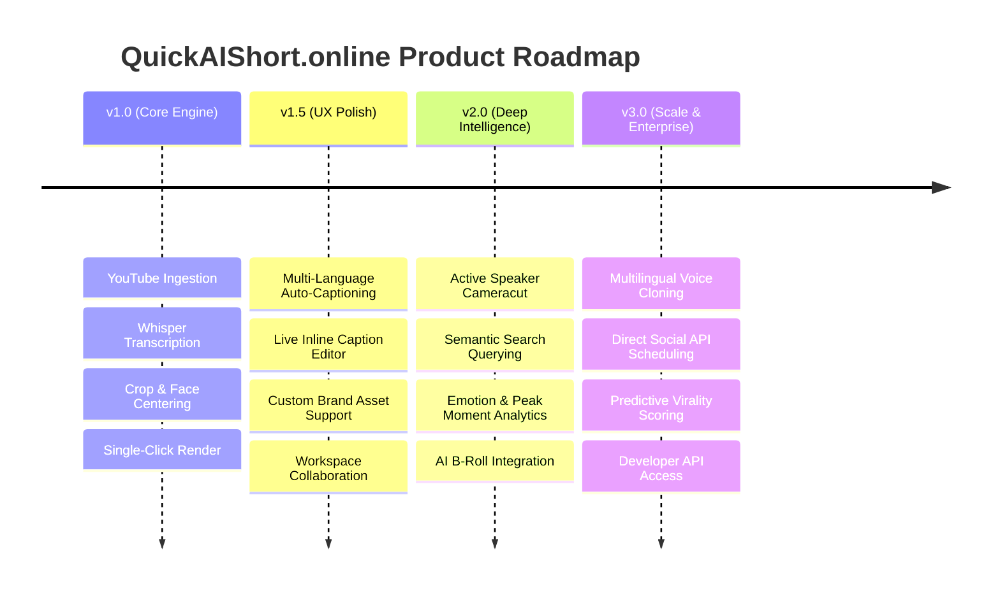

# 🚀 QuickAIShort.online — Vision & Product Roadmap

## 1. Executive Mission
Our mission is to democratize professional, short-form video creation by decoupling high-fidelity video processing from manual editing grinds. By leveraging agentic AI orchestration and state-of-the-art browser video previews, we enable creators to seamlessly repurpose long-form assets (podcasts, streams, webinars) into viral vertical shorts while preserving absolute creative agency.

---

## 2. Core Architectural Belief
Creators are the new enterprise media companies. However, they are currently constrained by highly repetitive, time-intensive post-production tasks. The highest-fidelity insights and storytelling are often locked behind multi-hour live streams and deep-dive technical podcasts that never get repurposed. 

We build infrastructure that automates the post-production assembly line so that creators can dedicate their cognitive focus entirely to creative content and strategic storytelling.

---

## 3. Product Principles

### Ⅰ. Automation Combined with Creative Agency
AI should handle the heavy technical lifting (speaker tracking, face detection, silent period truncation, dynamic transcript generation), but the human creator must retain final creative authority. Our tools act as collaborative copilots—suggesting highlights, caption timings, and compositions while providing direct, precise editing controls.

### Ⅱ. Time-To-Output (TTO) Optimization
We measure the success of every feature by the minutes it saves a creator. If a feature introduces cognitive complexity without directly compressing the post-production cycle, it is eliminated.

### Ⅲ. Studio-Quality Outputs
Automated output must equal or exceed professional, studio-level hand-edited files. We enforce strict typography scales, pixel-perfect aspect ratio scaling, professional audio compression, and sidechain ducking by default.

### Ⅳ. Community & Open Accessibility
The baseline editor and highlight generator remain highly accessible. We monetize complex, resource-heavy operations (e.g., automated multi-language voice cloning, bulk high-resolution rendering, and team workspace management), rather than restricting core post-production capabilities.

---

## 4. Strategic Product Roadmap



### Phase 1: Core Engine Optimization (v1.0 — Current)
* **Status:** **Completed & Deployed**
* **Milestones:**
  * High-performance YouTube stream extraction (4-tier extraction architecture).
  * Whisper-powered transcription models with high word-level precision.
  * 9:16 aspect ratio cropping with dynamic focal centering.
  * Three highly optimized, customizable typography caption themes.
  * Automated server-side transcode rendering via decoupled `render_worker.py` instances.

### Phase 2: User Polish & Interactive Control (v1.5 — Near Term)
* **Milestones:**
  * **Multilingual Caption Pipelines:** Auto-detect and transcribe content in over 15 world languages.
  * **WYSWYG Caption Editor:** Inline transcript text editing with real-time browser preview synchronization.
  * **Custom Brand Library:** Support custom font and logo asset uploads.
  * **Workspace Management:** Collaborate on video projects with multi-tenant workspace environments.

### Phase 3: Agentic Intelligence (v2.0 — Mid Term)
* **Milestones:**
  * **Active Speaker Tracking:** Multi-face tracking with automated video cuts for interview and panel formats.
  * **Semantic Highlight Extraction:** Query video collections using natural language (e.g., *"extract segments discussing financial models"*).
  * **Emotional Auditory Analytics:** Intelligent detection of laughter, volume spikes, and applause thresholds to isolate premium candidate moments.
  * **Automated Contextual B-Roll:** Inject relevant secondary stock footage context based on transcript semantics.

### Phase 4: Enterprise Scale (v3.0 — Long Term)
* **Milestones:**
  * **Synthetic Dubbing & Voice Cloning:** Instantly translate and dub voice tracks while preserving the original speaker's vocal characteristics.
  * **Automated Channel Syndication:** One-click publishing and scheduling across TikTok, YouTube Shorts, and Instagram Reels APIs.
  * **Predictive Performance Analytics:** Pre-evaluate highlight virality scores before publishing using audience persona loop agents.
  * **Platform SDK & API Access:** Expose core video cropping and transcription models for developer automation.

---

## 5. Market Opportunity & Strategic Advantage

The creator economy is projected to exceed **$250 Billion USD by 2027**. Short-form video platforms (TikTok, YouTube Shorts, Reels) represent the fastest-growing channels for audience acquisition, yet manual video repurposing remains highly unoptimized.

```
┌──────────────────┐       ┌────────────────────┐       ┌─────────────────┐
│  AI Highlights   │  ───► │  Visual Control    │  ───► │ High-Speed      │
│  (Focal Tracking)│       │  (WYSIWYG Editor)  │       │ Server Render   │
└──────────────────┘       └────────────────────┘       └─────────────────┘
```

QuickAIShort.online sits at the high-value intersection of **automated AI highlights, fine-grained creator editing control, and enterprise-grade rendering speed**.

---

## 6. Competitive Analysis Matrix

| Competitor | Strength | System Limitation | The QuickAIShort.online Advantage |
| :--- | :--- | :--- | :--- |
| **Opus Clip** | Automated highlights | Rigid editor controls, no manual reframing options. | **Dual Editing Control:** Seamlessly toggle between fully automated agent crops and custom timeline reframing. |
| **Descript** | Text-based editing | Complex desktop-centric UI, steep pricing tiers. | **Lightweight Web App:** High-speed cloud-based transcode engines with frictionless, zero-setup onboarding. |
| **CapCut** | High visual effects | Fully manual, non-automated highlight extraction. | **Autonomous Highlight Extraction:** Native agent teams auto-curate and prepare your premium vertical moments. |

---

**— The QuickAIShort.online Leadership Team**
