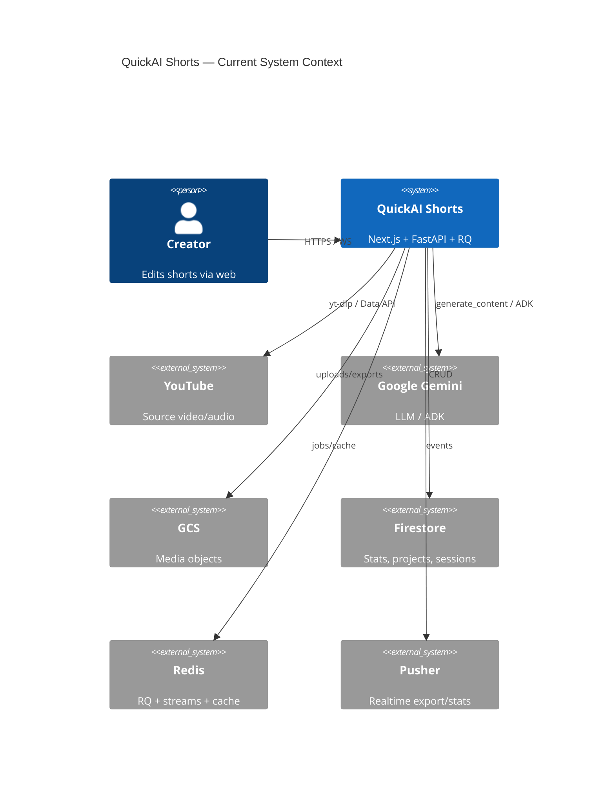

# 03 — Architecture

## C4 Level 1 — System context (current)



---

## C4 Level 2 — Containers (current, verified)

```text
┌──────────────┐     JWT      ┌─────────────────┐
│  Next.js FE  │─────────────►│  FastAPI (API)  │
│  Vercel      │              │  Cloud Run      │
│              │◄──Pusher/WS──│                 │
└──────┬───────┘              └────────┬────────┘
       │ Zustand NLE                   │ enqueue
       │ Whisper.wasm                  ▼
       │ optional FFmpeg.wasm   ┌─────────────────┐
       └───────────────────────►│ RQ render_worker│
                                │ Cloud Run       │
                                └────────┬────────┘
                                         ▼
                                      GCS + Redis
```

---

## Current architectural style

**Hybrid client NLE + server bake.**

| Concern | Authority today |
|---------|-----------------|
| Interactive timeline state | Browser `editorStore` (Zustand) |
| AI planning | Gemini JSON via FastAPI `ai_editor_*` |
| Action execution (preview) | Client `applyAiEdits` / `dispatchAIActions` |
| Final MP4 | Server ffmpeg (`render_worker` / `RenderService`) |
| Virality validation | ADK Pre-Flight on API |
| Credits/stats | Firestore via `stats_service` |
| Legacy upload path | Mongo GridFS `/api/v1/video/*` |

This is **valid** for a Studio evolution: keep client for interactive fidelity; grow server Tool Runtime for expensive/deterministic ops; converge on `RenderManifest` for export.

---

## Target architecture (Studio)

```text
User (Director)
    ↓ chat
Orchestrator Agent (planner + verifier)
    ↓ native function calls / tool loop
Tool Runtime
    ├─ Client Tools (Zustand mutations, preview)
    ├─ Server Tools (silence bake, B-roll, TTS, analysis)
    └─ Render Tools (manifest compile → RQ → GCS)
    ↓
Analysis Agent → Suggestion Rail (dynamic)
    ↓
Pre-Flight Agent (optional gate before publish)
```

---

## Vision alignment matrix

| Subsystem | Current | Intention | Gap | Reason | Approach | Complexity | Risk | Priority |
|-----------|---------|-----------|-----|--------|----------|------------|------|----------|
| Chat UX | AI panel + FAB; advanced panels behind `?advanced=1` | Chat primary | Medium | Product grew as timeline editor | Default chat-first layout; timeline dock secondary | M | Med | P0 |
| Suggestions | MediaGraph facets → pure derive (EP-003) | Same + optional deeper AnalysisAgent | Low for rail; Med for vision depth | Rail shipped; invent route retired 410 | Keep edge upsert + debounce; no title heuristics | L | Low | Done |
| Tool calling | Prompt-JSON | Native FC + runtime | High | Faster to ship JSON | Add Gemini tools; keep sanitiser | H | Med | P0 |
| NLE execution | Client store | Real tools | Medium | Correct for preview | Keep client; add server tools for bake | M | Low | P0 |
| Timeline truth | Client-only | Optional server project graph | High | Projects are script-oriented | Persist RenderManifest snapshots to Firestore | M | Med | P1 |
| Render | Segment/plan + partial manifest | Full manifest bake | Medium | Manifest young | Expand `manifest_renderer` coverage | H | Med | P1 |
| Pre-Flight | Strong ADK loop | Studio module | Low | Already aligned | Wire as chat tool `run_preflight` | L | Low | P1 |
| Storage | GCS + GridFS legacy | Single media plane | Medium | Migration incomplete | Freeze GridFS; alias URI cleanup | M | Med | P1 |
| Auth | NextAuth JWT | Same | Low | Docs wrong (firebase) | Fix docs; close pipeline auth hole | L | High | P0 |

---

## Principles for change

1. **No big-bang rewrite** of Next.js or FastAPI.  
2. **One tool catalogue** shared by FE, BE, prompts.  
3. **Sanitise then apply** remains mandatory.  
4. **RenderManifest** is the export contract.  
5. **Pre-Flight stays** as product moat.  
6. **Cost-first:** local heuristics + cache before Gemini.
