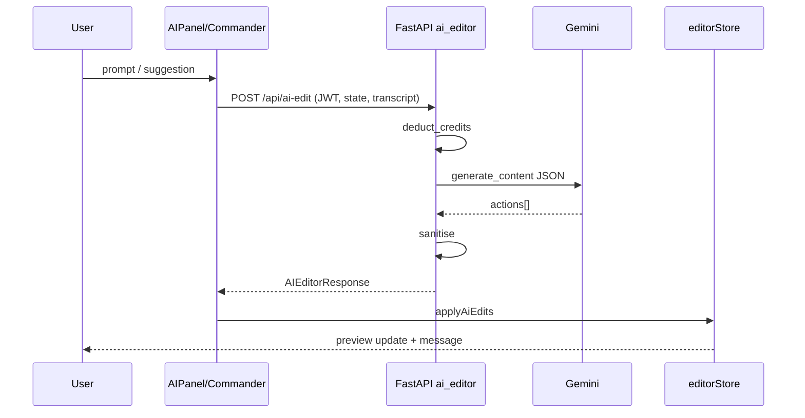
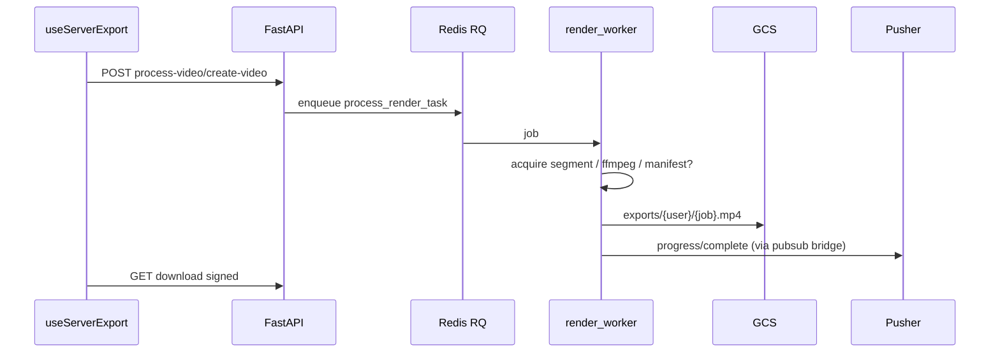

# 21 — Data Flows

## Flow A — Conversational edit (current)



## Flow B — Server export



## Flow C — Pre-Flight

```text
Clip candidate → POST /api/preflight → ADK graph → consensus score + recommendation → FE RightPanel / store
```

## Flow D — ADK Studio generate

```text
Upload GCS → enhance script → generate plan → enqueue multi-clip render → project record Firestore
```

## Flow E — Target Studio (future)

```text
Upload → AnalysisAgent (async) → SuggestionRail
Chat → Orchestrator (FC) → ToolRuntime → (ClientTools | ServerTools | RenderTools)
Optional → PreflightTool → ExportTool(manifest)
```
