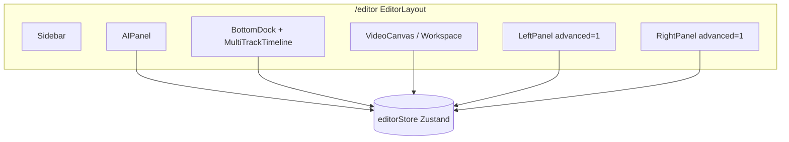
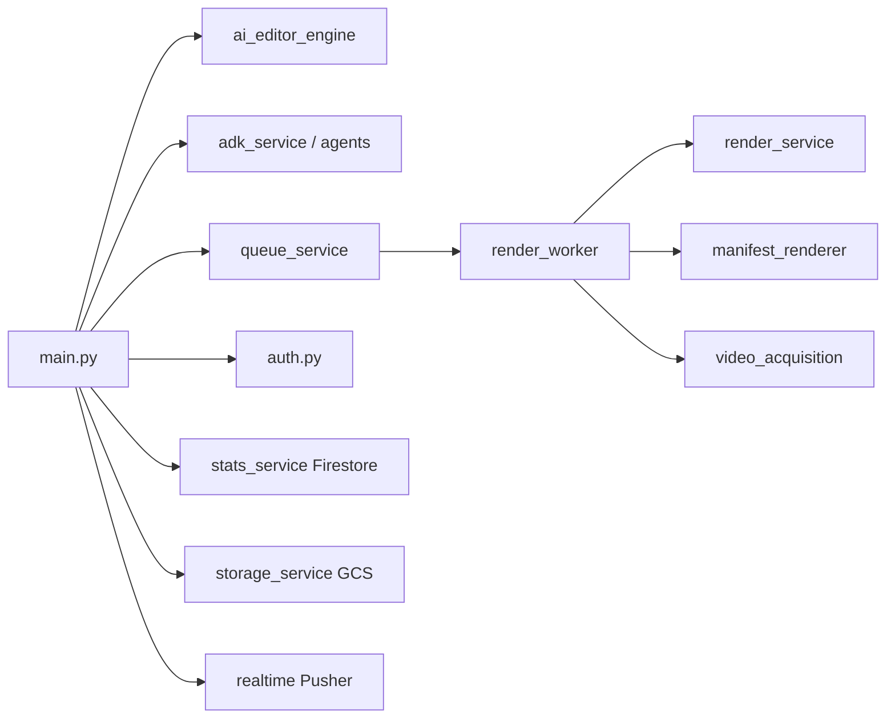
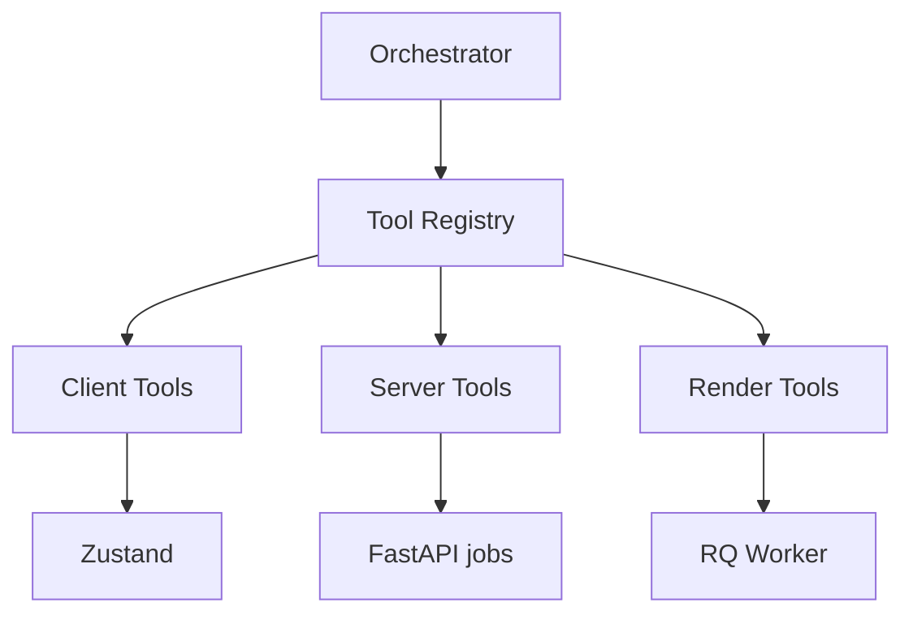

# 22 — Component Diagrams

## Frontend editor containers

```mermaid
flowchart TB
  subgraph Editor["/editor EditorLayout"]
    Side[Sidebar]
    Canvas[VideoCanvas / Workspace]
    Dock[BottomDock + MultiTrackTimeline]
    AI[AIPanel]
    AdvL[LeftPanel advanced=1]
    AdvR[RightPanel advanced=1]
  end
  Store[(editorStore Zustand)]
  AI --> Store
  Dock --> Store
  Canvas --> Store
  AdvL --> Store
  AdvR --> Store
```

## Backend service map

```mermaid
flowchart LR
  main[main.py]
  main --> aied[ai_editor_engine]
  main --> adk[adk_service / agents]
  main --> qs[queue_service]
  qs --> rw[render_worker]
  rw --> rs[render_service]
  rw --> mr[manifest_renderer]
  rw --> va[video_acquisition]
  main --> auth[auth.py]
  main --> stats[stats_service Firestore]
  main --> gcs[storage_service GCS]
  main --> rtx[realtime Pusher]
```

## Tool runtime target

```mermaid
flowchart TB
  Orch[Orchestrator]
  Reg[Tool Registry]
  Orch --> Reg
  Reg --> CT[Client Tools]
  Reg --> ST[Server Tools]
  Reg --> RT[Render Tools]
  CT --> Z[Zustand]
  ST --> API[FastAPI jobs]
  RT --> RQ[RQ Worker]
```
