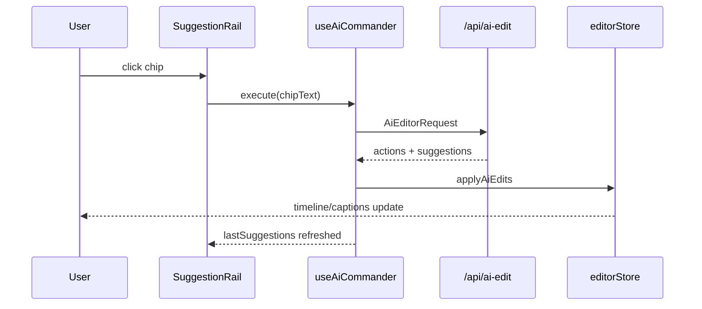
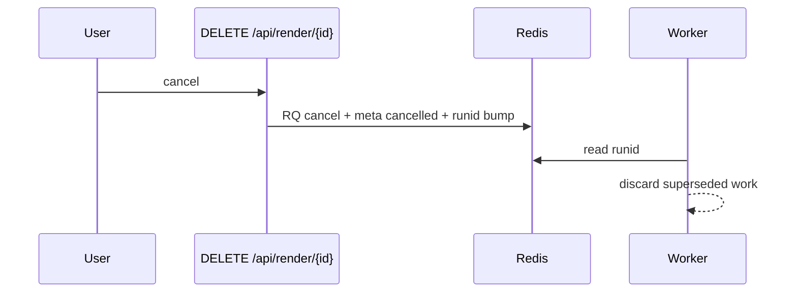
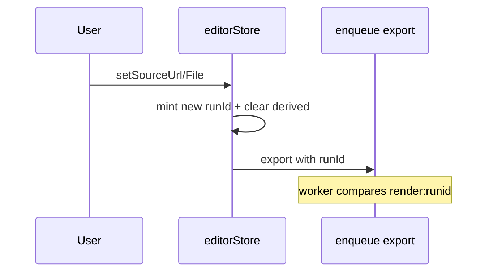

# 23 — Sequence Diagrams

## Suggestion click → edit

```mermaid
sequenceDiagram
  participant U as User
  participant Rail as SuggestionRail
  participant Cmd as useAiCommander
  participant API as /api/ai-edit
  participant Store as editorStore
  U->>Rail: click chip
  Rail->>Cmd: execute(chipText)
  Cmd->>API: AiEditorRequest
  API-->>Cmd: actions + suggestions
  Cmd->>Store: applyAiEdits
  Store-->>U: timeline/captions update
  Cmd-->>Rail: lastSuggestions refreshed
```

## Cancel in-flight render

```mermaid
sequenceDiagram
  participant U as User
  participant API as DELETE /api/render/{id}
  participant Redis as Redis
  participant W as Worker
  U->>API: cancel
  API->>Redis: RQ cancel + meta cancelled + runid bump
  W->>Redis: read runid
  W-->>W: discard superseded work
```

## Stale run guard on new source

```mermaid
sequenceDiagram
  participant U as User
  participant Store as editorStore
  participant API as enqueue export
  U->>Store: setSourceUrl/File
  Store->>Store: mint new runId + clear derived
  Store->>API: export with runId
  Note over API: worker compares render:runid
```
