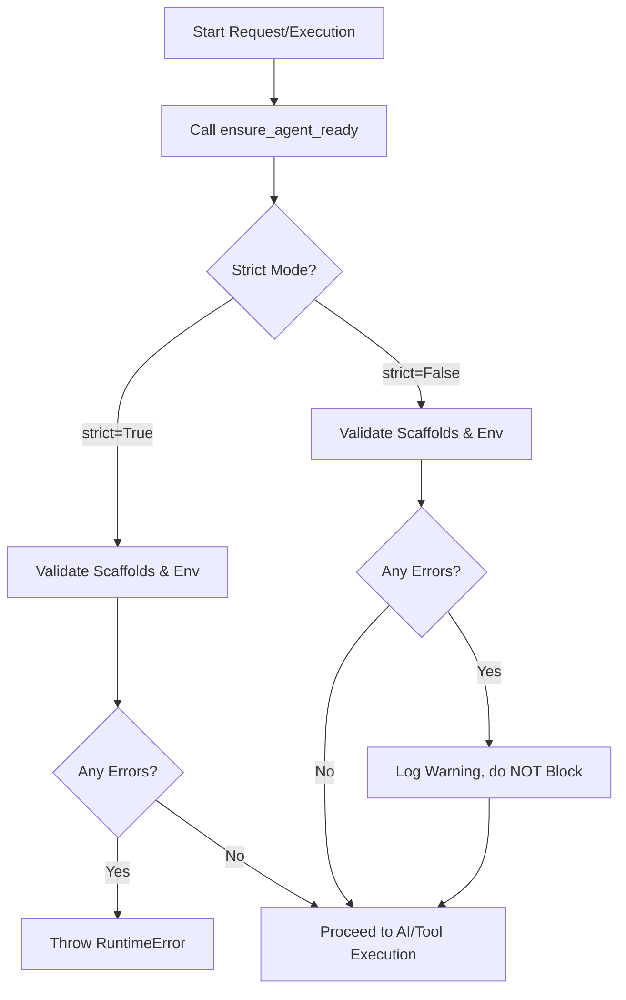

# QuickAI Short Agent Bootstrapping Sequence

This document describes the validation and bootstrapping sequence executed on application startup or pre-request execution.

## Boot Sequence

## Validation Routines

### 1. Scaffold Integrity Checks
- Locate and read the 5 core scaffold files: `SOUL.md`, `IDENTITY.md`, `AGENTS.md`, `MEMORY.md`, `BOOTSTRAP.md`.
- Ensure all files are non-empty.
- Scan for developmental placeholders:
  - `[T-O-D-O]`
  - `[P-L-A-C-E-H-O-L-D-E-R]`
  - `YOUR\_`
  - `CHANGE\_ME`

### 2. Environment Verification
- Match requested agent against its required environment variable catalog.
- If a required environment variable (e.g. `GEMINI_API_KEY`) is missing:
  - If `strict=True`, raise a critical error.
  - If `strict=False`, emit a structured log warning.
- If an optional environment variable (e.g. `SERPAPI_KEY` for grounding) is missing:
  - Always report as warning (never raises error even in strict mode).
